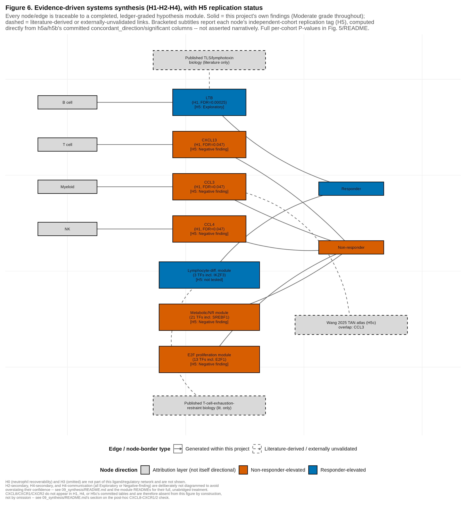

# Immune-compartment secretory and regulatory programmes associated with immune checkpoint response in melanoma

Immune checkpoint blockade produces durable responses in a minority of melanoma patients. An
elevated neutrophil-to-lymphocyte ratio is among the more reproducible clinical predictors of
treatment failure, but the tumour-level programme underlying that association is undefined
(`01_background`). This project asks which immune-compartment-derived secretory and regulatory
programmes distinguish checkpoint responders from non-responders in human melanoma, using
public single-cell (GSE120575, GSE72056) and bulk (GSE78220, GSE91061) RNA-seq.

Neutrophils are not recoverable in these datasets — a sequencing-protocol artefact (CD45+
sorting, Smart-seq2 plate-picking) rather than biological absence, established at the cell
level in `02_dataset_audit` and confirmed at the transcript level in `03_recruitment`. The
programme characterized here is therefore immune-compartment-derived rather than
neutrophil-specific, and immune-cell-autonomous rather than tumour-cell-derived (malignant
cells are ~0.04% of the discovery cohort). An unbiased screen of 327 candidate genes, with no
pathway named in advance, identifies four secreted factors distinguishing response; these
attribute to distinct immune-cell compartments, accompany a coherent transcription-factor
regulatory signature, and are tested for replication in two independent bulk cohorts. Agents
targeting neutrophil-recruitment signalling are already in early-phase melanoma trials
(`01_background`); whether this discovery converges on a therapeutically targeted axis is
examined post hoc, after the ranking below was fixed, in `09_synthesis`.

> **Central question:** Which immune-compartment-derived secretory and regulatory programmes
> distinguish immune checkpoint responders from non-responders in human melanoma?

*Every node and edge traces to a graded result in `results/evidence_ledger.tsv`. Solid = generated
within this project; dashed = literature-derived. Bracketed tags report independent-cohort
replication status.*

## Key results

| | Module | Tested | Result | Grade |
|---|---|---|---|---|
| H0 | [`02_dataset_audit`](02_dataset_audit) | Are neutrophils recoverable in public melanoma scRNA-seq? | No, in two independent cohorts — depleted by CD45+ sorting and Smart-seq2 plate-picking | Strong |
| H1 | [`03_recruitment`](03_recruitment) | Which secreted factors differ by ICB response? | LTB, CCL3, CCL4, CXCL13 (patient-level pseudobulk, n=19, FDR<0.05) | Moderate |
| H2 | [`04_cellular_sources`](04_cellular_sources) | Which immune compartments produce them? | LTB → B cell, CXCL13 → T cell, CCL3 → Myeloid, CCL4 → NK | Moderate |
| H3 | [`05_neutrophil_states`](05_neutrophil_states) | Do TANs occupy distinct functional states? | Omitted — see H0 | — |
| H4 | [`06_regulation_communication`](06_regulation_communication) | Is the programme regulatorily coherent? | ~31 effective independent transcription-factor programmes (of 56 nominal), organizing into a non-responder-elevated proliferation/metabolic axis and a responder-elevated lymphocyte-differentiation module; T-cell-directed communication not enriched for suppressive receptors | Moderate / Negative |
| H5 | [`07_validation_concordance`](07_validation_concordance) | Does the programme replicate in independent cohorts? | LTB direction-consistent in both cohorts (not significant); CCL3, CCL4, CXCL13, and both transcription-factor modules do not replicate; the discovery panel overlaps significantly with one independently published melanoma neutrophil marker set | Exploratory / Negative |
| — | [`08_experimental_translation`](08_experimental_translation) | — | Proposed validation experiments for each Moderate/Strong finding | — |
| — | [`09_synthesis`](09_synthesis) | — | Integrated synthesis across H0–H5 | — |

H1, H2, and H4's primary tests share one 19-patient cohort and its therapy-type confound —
they are complementary analytical lenses on that cohort, not independent confirmations. A
confound-adjustment and two independent bulk cohorts both single out LTB as the one hit robust
to replication; CCL3, CCL4, and CXCL13 are not (`03_recruitment`, `07_validation_concordance`).

## Datasets

| Accession | Study | Role |
|---|---|---|
| GSE120575 | Sade-Feldman et al. 2018 | Primary discovery, scRNA-seq, 19 pre-treatment patients |
| GSE72056 | Tirosh et al. 2016 | Independent replication of the neutrophil-recoverability audit |
| GSE78220 | Hugo et al. 2016 | Independent bulk RNA-seq validation cohort |
| GSE91061 | Riaz et al. 2017 | Independent bulk RNA-seq validation cohort |

## Limitations

The discovery cohort (GSE120575, n=19) has an uneven distribution of therapy type across
response groups; H1, H2, and H4's primary tests all inherit this confound rather than
providing independent confirmation of one another. Transcription-factor activity (H4) is
inferred from expression, not measured directly. External replication (H5) is limited to two
bulk cohorts and confirms only one of H1's four hits. Full limitations, per-module caveats, and
the evidence-grading rubric are documented in each module's README and consolidated in
`09_synthesis`.

## Negative results

Negative and null findings are reported with the same weight as positive ones;
`results/evidence_ledger.tsv`'s `result_direction` field makes this auditable. H0's negative
result — neutrophils are not recoverable in these datasets — determined the scope and design
of every hypothesis that follows.

## Repository structure

Each module documents a hypothesis, its analysis, evidence, interpretation, and limitations,
graded Strong / Moderate / Exploratory in `results/evidence_ledger.tsv`. `REPRODUCIBILITY.md`
documents the computing environment, datasets, and the command sequence to regenerate every
result and figure from a fresh clone. `CHANGELOG.md` records the reasoning behind every
deviation from the original analysis design.
